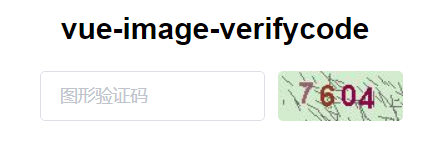

<p align="center">
  <a href="https://github.com/vuejs/vue">
    
  </a>
  <a href="https://github.com/ElemeFE/element">
    
  </a>
  <a href="https://github.com/wangxiaoyi3/vue-image-verifycode//LICENSE">
    
  </a>
  <a href="https://github.com/wangxiaoyi3/vue-image-verifycode/releases">
    
  </a>
</p>

# vue-image-verifycode

> An Image VerifyCode Component based on Vue.js and Element UI

## Install

``` bash
# install dependencies
npm install vue-image-verifycode --save
```

## Example

main.js

``` javascript
import ImageVerifyCode from 'vue-image-verifycode'
Vue.use(ImageVerifyCode)
```
App.vue

``` vue
<vue-image-verifycode :url="url"></vue-image-verifycode>
```

``` javascript
data() {
  return {
     url: 'https://xxxx' //Change to your image URL
   }
 }
```
demo



## More detail

If you want to know more, you can come to this website!
[vue-image-verifycode](http://vue-image-verifycode.wangyit.com)
